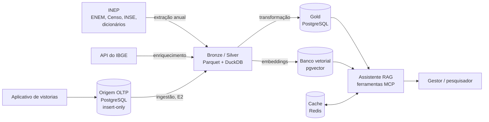
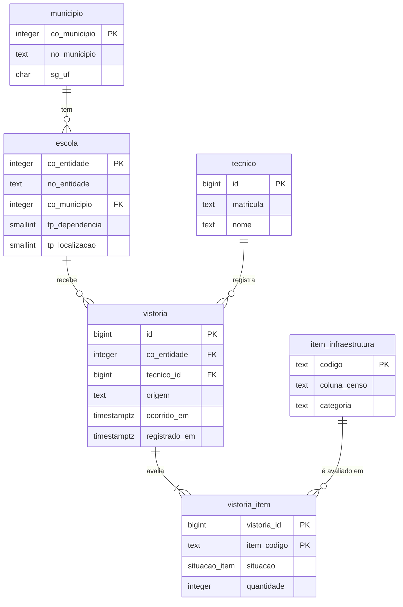

# EduInfra AI

Assistente RAG de infraestrutura escolar e desempenho no ENEM. Projeto
Integrado da Squad EduInfra na disciplina Sistemas de Banco de Dados 2
(UnB/FCTE, 2026/2).

**O que o sistema faz:** um sistema transacional (OLTP) de vistorias de
infraestrutura escolar, acoplado a um pipeline analítico e a um banco vetorial
que alimentam um assistente RAG.

**Problema que resolve:** extrair respostas rápidas e visuais dos microdados do
ENEM e do Censo Escolar exige, hoje, conhecimento técnico de SQL e de engenharia
de dados. O EduInfra AI permite que gestores educacionais e pesquisadores façam
essas perguntas em linguagem natural, pelo chat.

**Pergunta de gestão:** a infraestrutura de uma escola se reflete no desempenho
dos seus alunos no ENEM?

## Arquitetura

O dado passa por três estágios: o armazenamento bruto (Bronze e Silver), a
camada de serviço (Gold) e o consumo pelo assistente.



Na E1, só a origem OLTP e a carga do Censo estão implementadas.

| Estágio | O que guarda | Tecnologia | Por quê |
| --- | --- | --- | --- |
| Origem transacional | vistorias de infraestrutura registradas pela secretaria | PostgreSQL, insert-only | escrita concorrente com integridade forte, sem apagar o histórico da escola |
| Bronze e Silver (Data Lake) | microdados do INEP convertidos para formato colunar | Parquet (zstd) + DuckDB | a análise lê poucas colunas de milhões de linhas; DuckDB faz isso numa máquina só, sem cluster |
| Gold (Serving e Camada Semântica) | tabela fato escola × desempenho, pronta para consulta | PostgreSQL | o assistente e o painel precisam de respostas exatas e rápidas, por chave e com filtro |
| Banco vetorial | embeddings das escolas e do dicionário de variáveis | pgvector | a busca por escolas parecidas é distância entre vetores, não SQL |
| Cache semântico | respostas e gráficos já gerados | Redis | a mesma pergunta não gasta latência nem tokens duas vezes |

O assistente responde por ferramentas MCP. Perguntas numéricas ("gere um gráfico
da média do ENEM no DF comparando quem tem e quem não tem quadra") viram SQL
exato no PostgreSQL. Perguntas abstratas ("quais escolas têm perfil parecido com
a escola X?") vão para a busca por similaridade no banco vetorial.

## Estado atual: Entrega 1

A E1 pede uma fonte transacional modelada e populada com dado público. Este
repositório entrega:

- **origem de vistorias** em PostgreSQL 16, com esquema versionado em migrações
  Alembic;
- **modelo insert-only**: cada vistoria é um evento novo, com `ocorrido_em`
  (quando a realidade mudou na escola) separado de `registrado_em` (quando o dado
  entrou no banco). `UPDATE`, `DELETE` e `TRUNCATE` são bloqueados por gatilho
  ([ADR 0001](docs/adr/0001-modelagem-insert-only-do-sistema-de-origem.md));
- **carga reprodutível** do Censo Escolar 2024 com um comando: baixa o pacote do
  INEP, valida o cabeçalho e popula o banco como linha de base das vistorias;
- **carga idempotente**: rodar de novo não duplica nada.

Os estágios analítico, vetorial e de consumo chegam nas próximas entregas.

### Modelo da origem



- `escola` e `municipio` são cadastro: vêm do Censo e só aceitam correção.
- `vistoria` e `vistoria_item` são eventos: só aceitam `INSERT`. Uma mudança na
  escola é uma vistoria nova, não a edição da anterior.
- `situacao` é um de `existente`, `inexistente`, `em_obra`, `inutilizavel` ou
  `nao_informado`. Um item não informado não apaga o que a vistoria anterior
  disse.
- `tecnico` é o único lugar com dado pessoal.
- A view `escola_estado_atual` pega, para cada escola e item, o evento mais
  recente.

## Como subir

Pré-requisitos:

- Docker com Docker Compose v2 (`docker compose`, sem hífen);
- acesso à internet, porque a carga baixa cerca de 34 MB do INEP;
- cerca de 1 GB livre em disco: o banco ocupa 445 MB depois de populado.

O resto vem nas imagens: PostgreSQL 16 (`pgvector/pgvector:pg16`) e Python 3.12
com [uv](https://docs.astral.sh/uv/).

```bash
git clone https://github.com/daviegito/bd2_2026_2_eduinfra.git
cd bd2_2026_2_eduinfra
cp .env.example .env        # troque POSTGRES_PASSWORD e a senha em DATABASE_URL
docker compose up --build
```

O serviço `carga` roda as migrações, baixa e carrega o Censo 2024, imprime a
caracterização da base e termina com código 0. O serviço `banco` continua no ar.
Numa máquina limpa, o processo leva de 3 a 4 minutos.

Se a porta 5432 já estiver em uso, mude `PORTA_POSTGRES` no `.env`.

Para conferir a base populada:

```bash
docker compose exec banco psql -U eduinfra -d eduinfra \
  -c "select * from escola_estado_atual where co_entidade = 53002580;"
```

Para apagar tudo e começar do zero, inclusive o download em cache:

```bash
docker compose down -v
```

### Comandos da CLI

A imagem expõe a CLI `eduinfra`. Com o banco no ar:

| Comando | O que faz |
| --- | --- |
| `docker compose run --rm carga migrar` | aplica as migrações até a última revisão |
| `docker compose run --rm carga reverter --revisao 0003` | volta o esquema até a revisão indicada |
| `docker compose run --rm carga carregar` | baixa o Censo, se preciso, e carrega; é idempotente |
| `docker compose run --rm carga caracterizar` | imprime contagens e tamanhos em disco, em Markdown |
| `docker compose run --rm carga tudo` | os três primeiros em sequência; é o padrão do compose |

Para rodar fora do Docker, com [uv](https://docs.astral.sh/uv/) e o banco do
compose publicado na porta do `.env`:

```bash
uv sync
set -a && source .env && set +a
uv run eduinfra tudo
```

## O que a carga produz

Medido numa execução a partir de um clone limpo, em 26/09/2026, com o comando
`caracterizar`.

| Tabela | Linhas | O que guarda |
| --- | ---: | --- |
| `municipio` | 5.570 | municípios onde há escola em atividade |
| `escola` | 181.065 | escolas em atividade no Censo 2024 |
| `item_infraestrutura` | 17 | catálogo de itens vistoriados, com a coluna correspondente no Censo |
| `tecnico` | 1 | operador da carga automática; na operação real, os técnicos da secretaria |
| `vistoria` | 181.065 | uma vistoria de linha de base por escola, datada de 29/05/2024 |
| `vistoria_item` | 3.078.105 | a situação de cada item em cada vistoria |

`vistoria_item` ocupa 369 MB dos 445 MB do banco, somando dados e índices. É o
custo do modelo insert-only, discutido no
[ADR 0001](docs/adr/0001-modelagem-insert-only-do-sistema-de-origem.md). Cada
nova carga anual acrescenta perto de 3 milhões de linhas de item.

A escrita esperada do aplicativo da secretaria é de cerca de 500 vistorias por
dia, estimativa da Squad que ainda será medida. A leitura do estado atual de uma
escola deve ficar abaixo de 300 ms; medida com as estatísticas do banco
atualizadas, ela leva menos de 1 ms.

## Estrutura do repositório

```
alembic/versions/   migrações do esquema, em ordem (0001 a 0004)
src/eduinfra/       CLI, download, transformação e carga
  microdados.py     download retomável do pacote do INEP
  tls.py            completa a cadeia de certificados do INEP (ADR 0002)
  transformacao.py  valida o cabeçalho e gera o Parquet intermediário
  carga.py          staging, consolidação idempotente e resumo
  caracterizacao.py contagens e tamanhos da base populada
docs/adr/           registros de decisão de arquitetura
docker-compose.yml  banco PostgreSQL e serviço de carga
Dockerfile          imagem da carga, com uv
.env.example        variáveis de ambiente; copie para .env
```

## Documentação do processo

| Documento | Onde | Estado |
| --- | --- | --- |
| Decisões de arquitetura | [docs/adr/](docs/adr/) | ADRs 0001 e 0002 |
| Diário de bordo semanal | `docs/diario/` | em construção, issue #8 |
| Registro de uso de IA | `AI-USAGE.md` | em construção, issue #9 |

## Fontes de dados

| Fonte | Quem gera | Papel no projeto |
| --- | --- | --- |
| [Microdados do ENEM 2024](https://www.gov.br/inep/pt-br/acesso-a-informacao/dados-abertos/microdados/enem) | INEP | desempenho (variável dependente) |
| [Microdados do Censo Escolar 2024](https://www.gov.br/inep/pt-br/acesso-a-informacao/dados-abertos/microdados/censo-escolar) | INEP | infraestrutura (variável independente) e carga da origem |
| Indicador de Nível Socioeconômico (INSE) | INEP | controle socioeconômico das comparações |
| API do IBGE | IBGE | contexto regional do município da escola |
| Dicionários de variáveis | INEP | metadados da camada semântica e do RAG |
| Histórico de interação (prompts) | o próprio assistente | uso da plataforma |
| Sistema de vistorias | aplicativo da secretaria | origem transacional (OLTP) |

O projeto usa o ENEM de 2024 porque é a edição em que o INEP devolveu o código
da escola aos microdados, o que permite cruzar desempenho e infraestrutura no
grão escola.

Os microdados do INEP são anonimizados na origem. Na E1, o único dado pessoal é o
do técnico que registra a vistoria, na tabela `tecnico`, e ele não sai da origem
sem pseudonimização.

## Decisões de arquitetura

| ADR | Decisão |
| --- | --- |
| [0001](docs/adr/0001-modelagem-insert-only-do-sistema-de-origem.md) | Esquema insert-only com carimbo de tempo do evento na origem |
| [0002](docs/adr/0002-cadeia-tls-incompleta-do-inep.md) | Completar a cadeia TLS do INEP por AIA em vez de relaxar a verificação |

## Entregas

| Entrega | Tema | Data prevista |
| --- | --- | --- |
| E1 | Fonte transacional modelada e populada | 22/09/2026 |
| E2 | Ingestão em lote e captura de mudanças | 13/10/2026 |
| E3 | Camada analítica transformada, testada e orquestrada | 03/11/2026 |
| E4 | Plataforma completa, governada e defendida | 24/11/2026 |

Datas do [cronograma da disciplina](https://unb-bd2.github.io/Disciplina/cronograma/),
ainda provisórias.

## Equipe

| Integrante | GitHub |
| --- | --- |
| Artur Mendonça Arruda | [@ArtyMend07](https://github.com/ArtyMend07) |
| Davi Coelho | [@daviegito](https://github.com/daviegito) |
| Gabriel Lopes de Amorim | [@BrzGab](https://github.com/BrzGab) |
| Lucas Mendonça Arruda | [@lucasarruda9](https://github.com/lucasarruda9) |
| Marcos Vinícius | — |
| Pedro Sanchez | [@PedroDev-sketch](https://github.com/PedroDev-sketch) |
| Pedro Vargas | — |

## Licença

[GPL-3.0](LICENSE).
