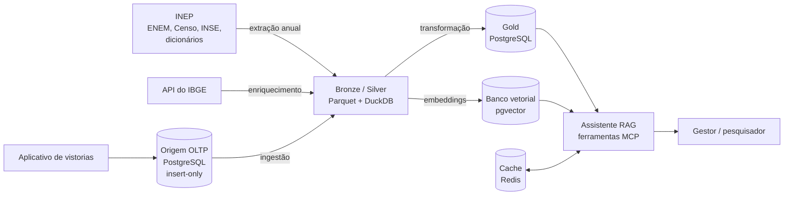
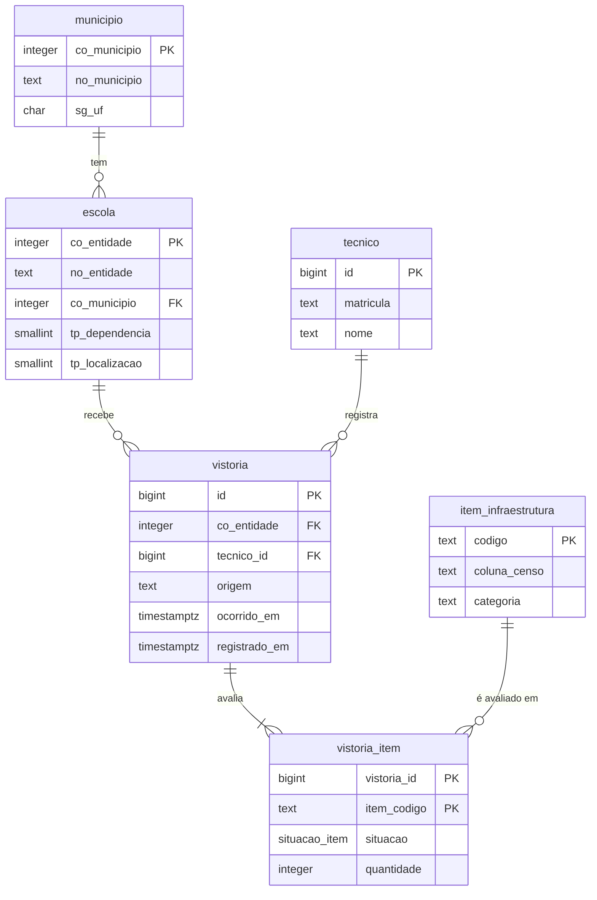

# EduInfra AI

Plataforma de dados que cruza infraestrutura escolar com desempenho no ENEM e responde em linguagem natural. Projeto integrado da Squad EduInfra na disciplina Sistemas de Banco de Dados 2 (UnB / FCTE, 2026.2).

Os microdados do ENEM e do Censo Escolar são públicos, mas cruzá-los exige SQL e engenharia de dados. O EduInfra AI constrói um pipeline analítico sobre esses dados e expõe um assistente RAG que permite a gestores educacionais e pesquisadores fazer perguntas em português, pelo chat, sem precisar escrever uma linha de código.

---

## Pergunta de Gestão

> **A infraestrutura de uma escola se reflete no desempenho dos seus alunos no ENEM?**

O sistema educacional brasileiro apresenta profundas disparidades regionais e estruturais. Embora o INEP publique anualmente volumes massivos de microdados, esses dados são consumidos em silos isolados, desconectados das decisões cotidianas de gestão escolar. A plataforma EduInfra AI nasce da necessidade de transformar esses dados dispersos em uma base analítica contínua e acionável.

| Quem usa | Que decisão toma |
| :--- | :--- |
| **Gestores e Secretarias de Educação** | Priorização de investimentos e alocação de orçamentos de reforma em escolas com carências estruturais críticas (laboratórios, internet, bibliotecas) |
| **Pesquisadores de Políticas Públicas** | Investigação sobre se carências materiais atuam como fatores explicativos de notas mais baixas, ou se o desempenho é predominantemente socioeconômico |
| **Técnicos de Vistoria** | Profissionais em campo que inspecionam instalações e registram a realidade física de cada escola diretamente no sistema transacional |

---

## Por que o ENEM de 2024?

Um dos maiores gargalos técnicos ao trabalhar com dados do INEP decorre das diretrizes de anonimização da LGPD. Entre as edições de **2018 e 2023**, o INEP adotou o chamado "modelo simplificado", suprimindo a variável `CO_ESCOLA` (código de identificação da escola) dos microdados públicos do ENEM. O objetivo era evitar que o cruzamento de quase-identificadores (município, sexo, raça, tamanho de turma) permitisse a reidentificação de participantes. Essa supressão impediu, durante seis anos, qualquer análise pública que vinculasse notas individuais ao estabelecimento de ensino.

Na edição de **2024**, o INEP restaurou o código da escola nos microdados. Por essa razão técnica e regulatória fundamental, a Squad EduInfra fixou a modelagem analítica na edição de 2024 — o único ano em que podemos cruzar infraestrutura predial com desempenho no grão fino de **escola**, sem recorrer a agregações forçadas por município que desvirtuariam o propósito do projeto.

---

## Arquitetura

O dado passa por três estágios: o armazenamento bruto (Bronze e Silver), a camada de serviço (Gold) e o consumo pelo assistente.

| Estágio | O que guarda | Tecnologia | Por quê |
| :--- | :--- | :--- | :--- |
| **Origem transacional** | Vistorias de infraestrutura registradas pela secretaria | PostgreSQL, insert-only | Escrita concorrente com integridade forte, sem apagar o histórico da escola |
| **Bronze e Silver** | Microdados do INEP convertidos para formato colunar | Parquet (zstd) + DuckDB | A análise lê poucas colunas de milhões de linhas; DuckDB faz isso numa máquina só, sem cluster |
| **Gold** | Tabela fato escola × desempenho, pronta para consulta | PostgreSQL | O assistente e o painel precisam de respostas exatas e rápidas, por chave e com filtro |
| **Banco vetorial** | Embeddings das escolas e do dicionário de variáveis | pgvector | A busca por escolas parecidas é distância entre vetores, não SQL |
| **Cache semântico** | Respostas e gráficos já gerados | Redis | A mesma pergunta não gasta latência nem tokens duas vezes |

O assistente responde por ferramentas MCP. Perguntas numéricas ("gere um gráfico da média do ENEM no DF comparando quem tem e quem não tem quadra") viram SQL exato no PostgreSQL. Perguntas abstratas ("quais escolas têm perfil parecido com a escola X?") vão para a busca por similaridade no banco vetorial.

---

## Modelagem da Origem

A origem transacional representa o **Sistema de Vistorias e Infraestrutura Escolar** — um banco que poderia estar em produção dentro de uma secretaria de educação. Os dados abertos governamentais funcionam como fotografias estáticas divulgadas com meses de atraso. Na prática, escolas sofrem reformas, equipamentos estragam, laboratórios são inaugurados e vistorias são conduzidas continuamente. A carga inicial do Censo Escolar 2024 atua como a *linha de base* (estado zero das 181.065 escolas em atividade), e o modelo transacional recebe os registros contínuos dos técnicos de campo.

| Tabela | Papel | Detalhe |
| :--- | :--- | :--- |
| `municipio` | Cadastro geográfico | 5.570 municípios com código IBGE, nome e UF. Preparado para enriquecimento futuro (PIB, IDH) |
| `escola` | Cadastro do estabelecimento | 181.065 escolas ativas pelo código `co_entidade`, com rede administrativa e localização (urbana/rural) |
| `item_infraestrutura` | Catálogo normalizado | 17 recursos físicos monitorados (laboratório, biblioteca, internet, refeitório, água, energia, etc.). Normalizar em tabela própria permite expandir o catálogo sem migrações DDL |
| `tecnico` | Auditoria | Agentes públicos responsáveis pelas vistorias. Única tabela com dado pessoal |
| `vistoria` | Cabeçalho do evento | Cada ato de inspeção vinculado a uma escola e a um técnico, com carimbos temporais auditáveis |
| `vistoria_item` | Fato atômico | Estado de cada item em cada vistoria. `situacao` é um ENUM com 5 valores: `existente`, `inexistente`, `em_obra`, `inutilizavel`, `nao_informado` |
| `escola_estado_atual` | View analítica | Window function que entrega a fotografia atualizada de qualquer escola em menos de 1 ms |

### Modelo Insert-Only

A decisão de modelagem mais crítica reside em como o sistema lida com a passagem do tempo. Em um CRUD convencional, registrar que uma escola construiu uma quadra de esportes seria um `UPDATE` na linha da escola, substituindo o valor anterior. Essa abordagem foi **formalmente descartada** pelo [ADR 0001](adr/0001-modelagem-insert-only-do-sistema-de-origem.md):

- **Destruição da causalidade temporal:** se a escola não tinha laboratório em maio de 2024 (quando o Censo foi coletado), mas constrói um em março de 2025, um `UPDATE` sobrescreveria o passado. Qualquer relatório futuro cruzaria as notas do ENEM de 2024 com uma infraestrutura que a escola só veio a ter em 2025, invalidando conclusões.
- **Event Sourcing:** cada vistoria é um evento histórico imutável. Uma nova constatação não apaga a anterior; acrescenta um registro no tempo.
- **Semântica temporal rígida:** `ocorrido_em` registra quando a escola mudou de fato; `registrado_em` registra quando o dado entrou no banco. Confundi-los produz relatórios inexplicáveis.
- **Garantia por triggers:** a imutabilidade é imposta por gatilhos no PostgreSQL que bloqueiam `UPDATE`, `DELETE` e `TRUNCATE` nas tabelas de eventos, devolvendo exceções explícitas.

---

## Pipeline de Ingestão

A ingestão da linha de base do Censo Escolar 2024 opera como um processo completamente automatizado, resiliente a falhas de rede e estritamente idempotente:

1. **Resolução TLS:** o pipeline inspeciona a extensão AIA (*Authority Information Access*) do certificado do INEP para baixar dinamicamente os certificados intermediários ausentes, mantendo a verificação de segurança 100% ativa ([ADR 0002](adr/0002-cadeia-tls-incompleta-do-inep.md)).
2. **Download resiliente:** o pacote compactado é transferido com suporte a retomada e tentativas exponenciais em caso de oscilações na infraestrutura governamental.
3. **Validação de esquema:** antes de persistir qualquer registro, os cabeçalhos do arquivo são validados contra o catálogo de 17 itens. Colunas ausentes ou renomeadas abortam o processo antes de contaminar a base.
4. **Carga idempotente:** os registros são inseridos com `ON CONFLICT DO NOTHING` sobre índices únicos parciais. Reexecuções não duplicam nada.

---

## Volumetria

Medição real a partir de execução limpa em 26/09/2026.

| Tabela | Linhas | Espaço | Natureza |
| :--- | ---: | ---: | :--- |
| `vistoria_item` | **3.078.105** | 369 MB | Escrita somente por `INSERT` |
| `vistoria` | 181.065 | 44 MB | Eventos de inspeção escolar |
| `escola` | 181.065 | 31 MB | Leitura por chave `co_entidade` |
| `municipio` | 5.570 | 464 kB | Dimensão geográfica |
| `item_infraestrutura` | 17 | 32 kB | Catálogo estático |
| **Total** | **3.445.823** | **445 MB** | |

A Squad realizou um experimento comparativo documentado no [ADR 0001](adr/0001-modelagem-insert-only-do-sistema-de-origem.md) medindo CRUD clássico contra Insert-Only. O modelo insert-only consome **39% a mais de disco** (414 MB contra 298 MB) e a leitura é ~4× mais lenta (0,12 ms contra 0,03 ms). A Squad decidiu conscientemente pagar esse custo porque a latência medida (< 1 ms) permanece ordens de grandeza abaixo do teto tolerado pela aplicação (300 ms), enquanto a capacidade de consultar o passado de qualquer escola viabiliza o projeto inteiro.

---

## Fontes de Dados

| Fonte | Quem gera | Papel no projeto |
| :--- | :--- | :--- |
| [Microdados do ENEM 2024](https://www.gov.br/inep/pt-br/acesso-a-informacao/dados-abertos/microdados/enem) | INEP | Desempenho (variável dependente) |
| [Microdados do Censo Escolar 2024](https://www.gov.br/inep/pt-br/acesso-a-informacao/dados-abertos/microdados/censo-escolar) | INEP | Infraestrutura (variável independente) e carga da origem |
| Indicador de Nível Socioeconômico (INSE) | INEP | Controle socioeconômico das comparações |
| API do IBGE | IBGE | Contexto regional do município da escola |
| Dicionários de variáveis | INEP | Metadados da camada semântica e do RAG |
| Sistema de vistorias | Aplicativo da secretaria | Origem transacional (OLTP) |

Os microdados do INEP são anonimizados na origem. Na E1, o único dado pessoal é o do técnico que registra a vistoria (tabela `tecnico`), e ele não sai da origem sem pseudonimização.

---

## Roadmap

| Entrega | Tema | Prazo |
| :---: | :--- | :--- |
| **E1** | Fonte transacional modelada e populada | 22/09/2026 |
| E2 | Ingestão em lote e captura de mudanças (CDC) | 13/10/2026 |
| E3 | Camada analítica transformada, testada e orquestrada | 03/11/2026 |
| E4 | Plataforma completa, governada e defendida | 24/11/2026 |

Datas do [cronograma da disciplina](https://unb-bd2.github.io/Disciplina/cronograma/), ainda provisórias.

---

## Equipe

| Integrante | GitHub |
| :--- | :--- |
| Artur Mendonça Arruda | [@ArtyMend07](https://github.com/ArtyMend07) |
| Davi Coelho | [@daviegito](https://github.com/daviegito) |
| Gabriel Lopes de Amorim | [@BrzGab](https://github.com/BrzGab) |
| Lucas Mendonça Arruda | [@lucasarruda9](https://github.com/lucasarruda9) |
| Marcos Vinícius | — |
| Pedro Sanchez | [@PedroDev-sketch](https://github.com/PedroDev-sketch) |
| Pedro Vargas | — |

Squad EduInfra · Sistemas de Banco de Dados 2 · UnB / FCTE · 2026.2  
[Repositório](https://github.com/daviegito/bd2_2026_2_eduinfra) · [GPL-3.0](https://github.com/daviegito/bd2_2026_2_eduinfra/blob/main/LICENSE)
